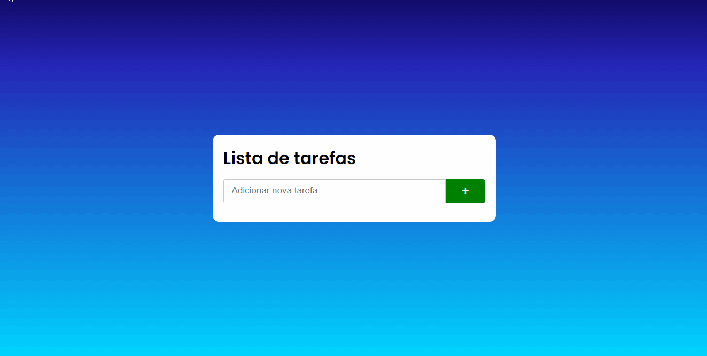

<h1 align="center">ToDo list em Javascript</h1>

<h4 align="center">Lista de tarefas responsivo que adiciona, remove e marca com check as tarefas feitas. Além disso ele salva as alterações, sejam dados adicionados, removidos ou marcados, no LocalStorage para que não perca suas anotações.</h4>

>Gif do projeto em funcionamento

 

<h4 align="center"><a href="https://pdro-marqss.github.io/Todo-JS-App/" target="_blank">Use o app clicando aqui</a></h4>

 

## Tecnologias utilizadas
Para o desenvolvimento dessa aplicação, foram utilizadas as tecnologias:

- HTML;
- CSS;
- Javascript;
- LocalStorage;

